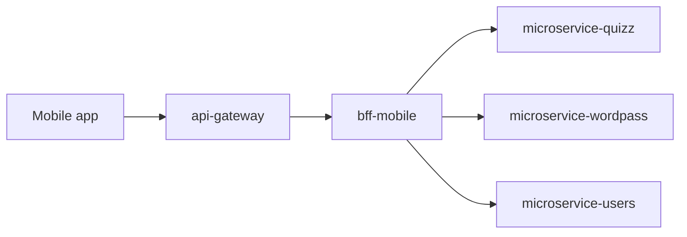

# bff-mobile

Last updated: 2026-05-03.

Backend-for-Frontend service for AxiomNode mobile clients.

## Responsibility

`bff-mobile` is the mobile channel facade. It provides mobile-shaped contracts while insulating the app from domain-service topology and internal contract churn.

## Runtime role

### Runtime context

### Main responsibilities

- Expose mobile-oriented APIs with lightweight payloads.
- Orchestrate quiz and word-pass game flows.
- Isolate mobile clients from internal service topology changes.

## Runtime surface

### Concrete orchestration scope

`bff-mobile` is intentionally thin:

- it does not own business persistence
- it does not hold shared runtime routing state
- it translates mobile-facing requests into explicit downstream calls with mobile-shaped responses

Cross-repo mobile orchestration, payload semantics, and player-sync behavior are documented in the mobile gameplay capability dossier so this README can stay at repository level.

### Primary use cases

- serve random playable quiz and word-pass content
- trigger generation flows through downstream services
- aggregate mobile-ready responses with minimal coupling to internal service boundaries
- expose stable public mobile entry semantics behind the gateway layer

## Local setup

### Repository structure

- `src/`: Fastify + TypeScript implementation.
- `docs/`: architecture, guides, and operations docs.
- `.github/workflows/ci.yml`: CI + deployment dispatch trigger.

### Local development

1. `cd src`
2. `cp .env.example .env`
3. From `secrets`, run `node scripts/prepare-runtime-secrets.mjs dev`
4. `npm install`
5. `npm run dev`

### Route note

This service owns the mobile-facing profile, category, random gameplay, generation, and event-sync routes. Use `docs/architecture/README.md` and the mobile gameplay capability dossier for the concrete inventory.

## Dependencies and contracts

### Dependency model

Primary downstream dependencies:

- `microservice-quizz`
- `microservice-wordpass`

Indirect runtime dependencies reached through those services:

- `ai-engine-api`
- `ai-engine-stats`

## Deployment and operations notes

### CI/CD and rollout note

CI, image publication, and staging rollout behavior are documented in `docs/operations/README.md` and `../docs/operations/cicd-workflow-map.md`.

### Internal dependencies

- `QUIZZ_SERVICE_URL`
- `WORDPASS_SERVICE_URL`
- `USERS_SERVICE_URL`

### State and persistence

`bff-mobile` keeps a lightweight embedded player database for mobile profile and event sync:

- `PLAYER_DB_FILE` controls the JSON persistence file (default `./data/player-db.json`)
- stores per-player profile metadata and synced game events
- used only for mobile player profile and stats snapshot APIs

## Documentation

- `docs/README.md`
- `docs/architecture/README.md`
- `docs/guides/README.md`
- `docs/operations/README.md`

### Operational notes

- This service is part of the covered automatic staging deployment chain.
- Validation failure prevents image publication for the triggering push.
- Docs-only pushes should not trigger central image publication anymore.

### Failure boundaries

- domain service unavailable or slow
- malformed downstream response that cannot be shaped into the mobile contract
- generation latency inherited from quiz/word-pass services

## References

- `docs/architecture/`
- `docs/operations/`
- `../docs/guides/capabilities/player/mobile-gameplay-orchestration.md`
- `../docs/operations/cicd-workflow-map.md`
