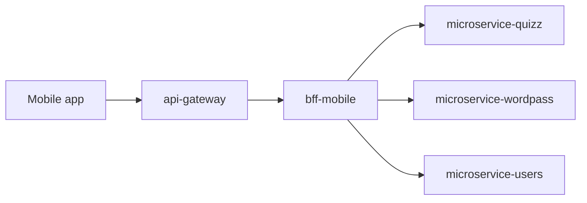

# bff-mobile

Backend-for-Frontend service for AxiomNode mobile clients.

## Architectural role

`bff-mobile` is the mobile channel facade. It provides mobile-shaped contracts while insulating the app from domain-service topology and internal contract churn.

## Runtime context

## Responsibilities

- Expose mobile-oriented APIs with lightweight payloads.
- Orchestrate quiz and word-pass game flows.
- Isolate mobile clients from internal service topology changes.

## Concrete orchestration scope

`bff-mobile` is intentionally thin:

- it does not own business persistence
- it does not hold shared runtime routing state
- it translates mobile-facing requests into explicit downstream calls with mobile-shaped responses

## Primary use cases

- serve random playable quiz and word-pass content
- trigger generation flows through downstream services
- aggregate mobile-ready responses with minimal coupling to internal service boundaries
- expose stable public mobile entry semantics behind the gateway layer

## Repository structure

- `src/`: Fastify + TypeScript implementation.
- `docs/`: architecture, guides, and operations docs.
- `.github/workflows/ci.yml`: CI + deployment dispatch trigger.

## Local development

1. `cd src`
2. `cp .env.example .env`
3. From `secrets`, run `node scripts/prepare-runtime-secrets.mjs dev`
4. `npm install`
5. `npm run dev`

## Main routes

- `GET /health`
- `GET /v1/mobile/games/quiz/random`
- `GET /v1/mobile/games/wordpass/random`
- `POST /v1/mobile/games/quiz/generate`
- `POST /v1/mobile/games/wordpass/generate`

## Dependency model

Primary downstream dependencies:

- `microservice-quizz`
- `microservice-wordpass`

Indirect runtime dependencies reached through those services:

- `ai-engine-api`
- `ai-engine-stats`

## CI/CD workflow behavior

- `ci.yml`
	- Trigger: push (`main`, `develop`), pull request, manual dispatch.
	- Job `build-test-lint`: checks out `shared-sdk-client` with `CROSS_REPO_READ_TOKEN`, blocks tracked `src/node_modules` / `src/dist`, then runs install, build, test, lint, and production `npm audit --omit=dev --audit-level=high`.
	- Job `trigger-platform-infra-build`:
		- Runs on push to `main`.
		- Waits for `build-test-lint` to succeed before evaluating dispatch.
		- Skips `platform-infra` dispatch on docs-only or workflow-only changes.
		- Dispatches `platform-infra/.github/workflows/build-push.yaml` with `service=bff-mobile`.
		- Requires `PLATFORM_INFRA_DISPATCH_TOKEN` in this repo.

## Deployment automation chain

Push to `main` triggers image rebuild in `platform-infra`, then automatic Kubernetes deployment to `stg` when repository validation and central packaging succeed.

## Internal dependencies

- `QUIZZ_SERVICE_URL`
- `WORDPASS_SERVICE_URL`

## State and persistence

`bff-mobile` is expected to remain stateless:

- no repository-owned database
- no repository-owned routing override storage
- no shared operator state

## Operational notes

- This service is part of the covered automatic staging deployment chain.
- Validation failure prevents image publication for the triggering push.
- Docs-only pushes should not trigger central image publication anymore.

## Failure boundaries

- domain service unavailable or slow
- malformed downstream response that cannot be shaped into the mobile contract
- generation latency inherited from quiz/word-pass services

## Related documents

- `docs/architecture/`
- `docs/operations/`
- `../docs/operations/cicd-workflow-map.md`
